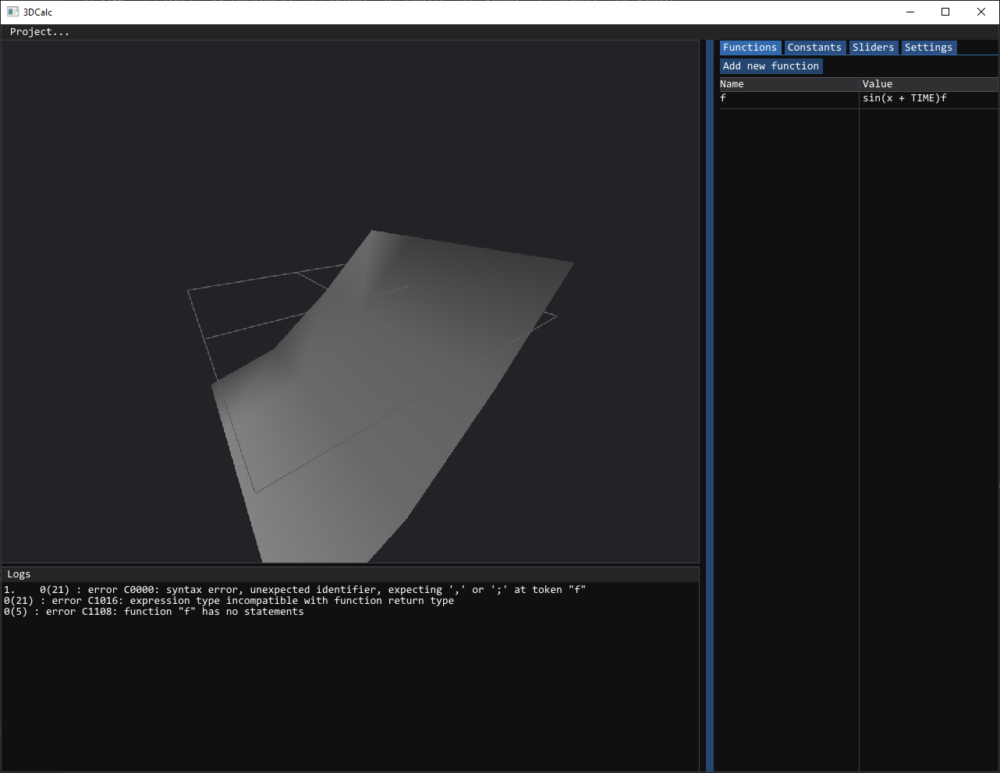
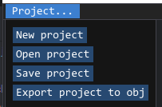
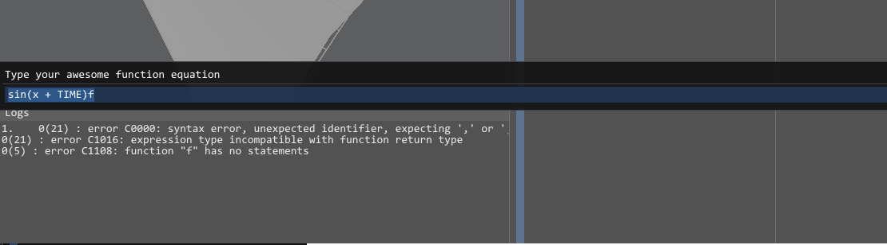
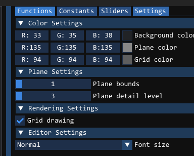

# 3D Graph Calculator
It's an application made for university project. It's written in C++ and OpenGL, and allows one to write one line functions in GLSL, that get applied to the mesh plane. You also get access to special variables like `time`. It's basically a dumbed down version of online tool "ShaderToy". You can save your projects, load them later, and export your result to the .obj file.

## Capabilities
### Project tab
In here, you can save, load or create new projects.
You can also export your creation to .obj file\

### Editor tabs
- Functions - A list of named functions that can have access to all GLSL functions along with my TIME function to animate the plane. You can also drag functions to reorder them or rename them. 
Double clicing function equation will bring up modal, giving you more workspace area:

- Constants - A list of your constants
- Sliders - A list of easy to use sliders with their custom names, that can be referenced by you inside function equation
- Settings - A list of visual settings along with desired plane detail and plane bounds:

# Example function
Equation: `smoothstep(0.0,0.5,sin(x+TIME)*cos(z+TIME)/clamp(tan(x),0.0,1.0))`

Result (GIF):

## How to install
### Requirements
- A Windows system
- CMake ver. 3.12>=
- C++ 20 compiler
- Build system: Make, Ninja, VS2022
### How to build
Clone this repository on your machine and run one of the two provided PowerShell scripts from **the main directory**.
The output files, along with the executable, should be in *"<MainDir/out/src>"*.

**Alternatively**, you can download built project [3dcalculator.zip](https://github.com/ThinCan/3dgraph/raw/built_binaries/3dcalculator.zip).
